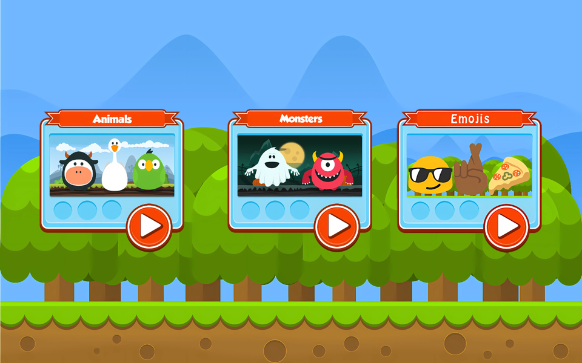

# Memory Game

A simple memory game for kids aged 4+. No ads, no accounts, no complicated screens: pick a theme,
pick a difficulty, find the pairs before the clock runs out.

<p align="center">
  
  
  
  
</p>

- 3 themes: Animals, Monsters and Emojis
- 6 difficulties, from 3x2 up to 10x5 cards
- Stars and best times per level, sounds on winning

## The story

**2014 to 2019.** The game was written in Java, released on Google Play as
[Memory Game (Free)](https://play.google.com/store/apps/details?id=com.snatik.matches) and published
here as open source. The last release was version 1.01.001007 in February 2019.

**2019 to 2026.** Maintenance stopped. Google Play removed the app in November 2019 for not keeping
up with its developer policies, and the code sat still while Android moved on by twelve API levels.

**2026.** The revival. The whole app was converted from Java to Kotlin, restructured, debugged,
tested and prepared for release purely with AI (Claude Code), with the original artwork and gameplay
kept intact. It is on its way back to the store.

## Building

Standard Android Studio project: Kotlin, AndroidX, Gradle Kotlin DSL, target SDK 36, min SDK 24.

```
./gradlew :app:assembleDebug        # debug build, installs next to the store version
./gradlew :app:testDebugUnitTest    # game-logic unit tests
./gradlew :app:lintDebug            # lint, warnings are errors
./gradlew checkKeystore             # verify the signing keystore configuration
scripts/verify-release.sh           # signed release APK + AAB with pre-upload checks
```

Signing and the Play Store checklist are in [docs/RELEASE.md](docs/RELEASE.md). Signing material
never lives in this repository. The [privacy policy](https://sromku.com/memory-game/privacy.html)
is published from the `sromku.github.io` site repository.

## Artwork

The originals live in `art/original`. Everything the app draws is generated from them by one Gradle
task, so a change to an original is a rerun and a commit:

- **Cards** are vector characters. Each picture is upscaled 4x with Real-ESRGAN, traced to paths
  with vtracer, and its parts (body, eyes, pupils, shadow) tagged by geometry into
  `app/src/main/assets/characters/<name>.chr`. The app draws them on a Canvas, crisp at any size,
  and animates them: breathing and blinking while face up, a hop when matched. Tagging mistakes are
  corrected in `art/character-overrides.txt`.
- **UI art** (buttons, popups, theme cards) becomes one vector drawable per asset: colours are bled
  into the transparent area, the silhouette is traced from the alpha channel and used as a clip
  path, and the soft drop shadow becomes one translucent path. The title (a hatched texture) and
  the play-button glow (a translucent gradient) do not trace well and stay WebP, rendered at the
  exact pixel size for every density bucket. Backgrounds stay WebP too.
- **Launcher and Play Store icons** come from `art/original/app_icon.png` the same way.

```
brew install webp
# download realesrgan-ncnn-vulkan and vtracer for macOS from their GitHub releases
./gradlew regenerateArt -Prealesrgan=/path/to/realesrgan-ncnn-vulkan -Pvtracer=/path/to/vtracer
```

## Rules for changes

The Play listing declares the game for children and certifies COPPA and GDPR compliance. Any change
must keep it free of data collection, network access, permissions, ads, purchases and third-party
SDKs; `CLAUDE.md` spells this out and the `checkChildSafety` task fails the build when it can tell.

## Code layout

- `game/` pure Kotlin rules: `Difficulty`, `Board` (shuffled pairs), `GameEngine` (flip state machine), `GameResult` (stars and score)
- `data/GamePreferences` best stars and times, key-compatible with the 2019 release
- `ui/GameViewModel` the round in progress, its clock, and the timing of every effect
- `ui/...` one fragment per screen, the board and tile views, the popups
- `ui/character/` the vector card characters and their animation
- `audio/SoundPlayer` sound effects through `SoundPool`

## License

- Code: [Apache License 2.0](./LICENSE)
- Artwork is licensed separately from its authors:
  - http://graphicriver.net/item/animals-collection-farm-and-domestic-set/7177721
  - http://graphicriver.net/item/monster-creation-kit-and-large-pack/8851390
  - http://graphicriver.net/item/10-fresh-game-backgrounds/9137937
  - http://graphicriver.net/item/cartoon-games-gui-pack-11-/6056785
