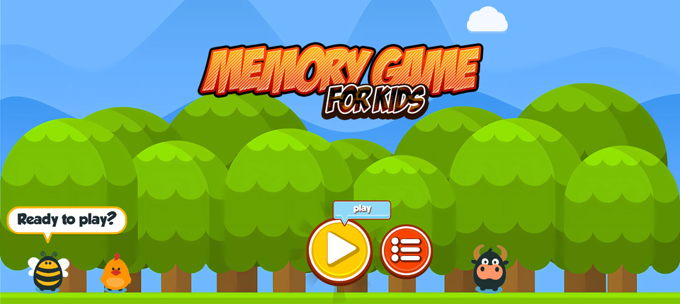
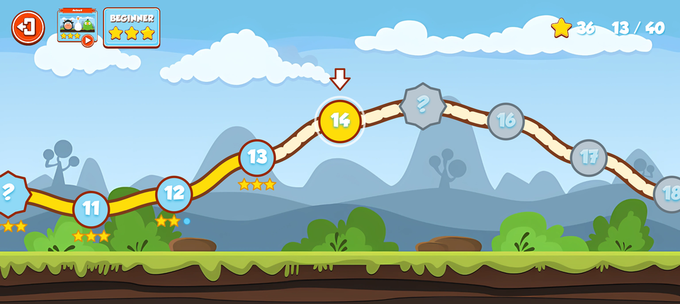
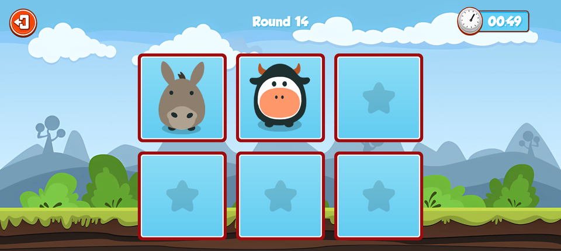
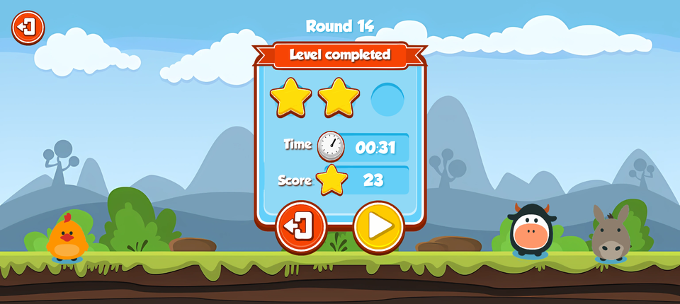

# Memory Game

A memory game for kids aged 4+. No ads, no accounts, nothing collected: press Play, walk a road of
rounds, find the pairs before the clock runs out, collect stars.

<p align="center">
  
  
  
  
</p>

- 3 themes: Animals, Monsters and Emojis, each with its own progress
- 6 roads per theme, from 3x2 up to 10x5 cards, 40 rounds each; the next road opens as you play
- Every fifth round is a mini-game: "Who was here?" and "Follow the song"
- Stars per round, confetti and hopping friends when a round is done, a friend of the day on the menu
- 21 languages, switchable in the game's settings
- Works on phones and tablets, in landscape, offline

## The story

**2014 to 2019.** The game was written in Java, released on Google Play as
[Memory Game (Free)](https://play.google.com/store/apps/details?id=com.snatik.matches) and published
here as open source. The last release was version 1.01.001007 in February 2019.

**2019 to 2026.** Maintenance stopped. Google Play removed the app in November 2019 for not keeping
up with its developer policies, and the code sat still while Android moved on by twelve API levels.

**2026.** The revival. The whole app was converted from Java to Kotlin, restructured, debugged,
tested and prepared for release purely with AI (Claude Code), with the original artwork and gameplay
kept intact. Then it grew: the single round per difficulty became roads of forty rounds, two
mini-games arrived on the special rounds, the menu came alive, and the game learned twenty new
languages, with the words lifted out of the artwork so every picture could speak them. It is on its
way back to the store.

## Building

Standard Android Studio project: Kotlin, AndroidX, Gradle Kotlin DSL, target SDK 36, min SDK 24.

```
./gradlew :app:assembleDebug        # debug build, installs next to the store version
./gradlew :app:testDebugUnitTest    # game-logic unit tests
./gradlew :app:lintDebug            # lint, warnings are errors
./gradlew checkKeystore             # verify the signing keystore configuration
scripts/verify-release.sh           # signed release APK + AAB with pre-upload checks
```

Signing and the Play Store checklist are in [docs/RELEASE.md](docs/RELEASE.md). Signing material
never lives in this repository. The [privacy policy](https://sromku.com/memory-game/privacy.html)
is published from the `sromku.github.io` site repository.

## Artwork

The originals live in `art/original`. Everything the app draws is generated from them by one Gradle
task, so a change to an original is a rerun and a commit:

- **Cards** are vector characters. Each picture is upscaled 4x with Real-ESRGAN, traced to paths
  with vtracer, and its parts (body, eyes, pupils, shadow) tagged by geometry into
  `app/src/main/assets/characters/<name>.chr`. The app draws them on a Canvas, crisp at any size,
  and animates them: breathing and blinking while face up, a hop when matched. Tagging mistakes are
  corrected in `art/character-overrides.txt`.
- **UI art** (buttons, popups, theme cards) becomes one vector drawable per asset: colours are bled
  into the transparent area, the silhouette is traced from the alpha channel and used as a clip
  path, and the soft drop shadow becomes one translucent path. The pictures carry no words: the
  lettered originals are kept in `art/original/lettered`, `tools/erase-lettering.py` writes
  de-lettered copies, and the app draws the words at runtime in the language of the player.
- **The title** is a hatched texture that does not trace well and stays WebP. English keeps the
  hand-made original; `tools/generate-titles.py` draws the other languages in the same style.
  The play-button glow and the backgrounds stay WebP too.
- **Launcher and Play Store icons** come from `art/original/app_icon.png` the same way.

```
brew install webp
# download realesrgan-ncnn-vulkan and vtracer for macOS from their GitHub releases
./gradlew regenerateArt -Prealesrgan=/path/to/realesrgan-ncnn-vulkan -Pvtracer=/path/to/vtracer
```

## Languages

English plus twenty languages. The translations are Python data in `tools/i18n`, one dictionary per
language, and `tools/i18n/generate.py` writes the `values-<locale>` resources from them. Grobold,
the display font, has Latin letters only, so `@font/game` resolves per language to Rubik, Baloo 2
or Mitr (all Open Font License), and Chinese, Japanese and Korean use the system font. See
[docs/design/localisation.md](docs/design/localisation.md).

## Rules for changes

The Play listing declares the game for children and certifies COPPA and GDPR compliance. Any change
must keep it free of data collection, network access, permissions, ads, purchases and third-party
SDKs; `CLAUDE.md` spells this out and the `checkChildSafety` task fails the build when it can tell.

## Code layout

- `game/` pure Kotlin rules: `Difficulty`, `Board`, `GameEngine` (flip state machine), `GameResult` (stars and score)
- `game/progression/` roads and rounds (`RoundSpec`, `Road`) and the player's `Progress`
- `game/minigame/` the rules of "Who was here?" and "Follow the song"
- `data/` `ProgressStore` (the versioned progress file) and `GamePreferences` (sound, language, last road; keys compatible with 2019)
- `ui/GameViewModel` the screen flow, the round in progress, its clock, and the timing of every effect
- `ui/road/` the map: `RoadGeometry` places rounds, `RoadNode` states them, `RoadMapView` draws them
- `ui/minigame/` the mini-game screens and the party scene they share
- `ui/image/` `ArtCache` (traced vectors rendered once), `LabeledDrawable` (words on art)
- `ui/character/` the vector card characters and their animation
- `audio/SoundPlayer` sound effects and the mini-game notes (`tools/generate-sounds.py`)
- Design notes for every feature are in `docs/design`.

## License

- Code: [Apache License 2.0](./LICENSE)
- Artwork is licensed separately from its authors:
  - http://graphicriver.net/item/animals-collection-farm-and-domestic-set/7177721
  - http://graphicriver.net/item/monster-creation-kit-and-large-pack/8851390
  - http://graphicriver.net/item/10-fresh-game-backgrounds/9137937
  - http://graphicriver.net/item/cartoon-games-gui-pack-11-/6056785
- Fonts Rubik, Baloo 2 and Mitr: SIL Open Font License, see `docs/licenses`
